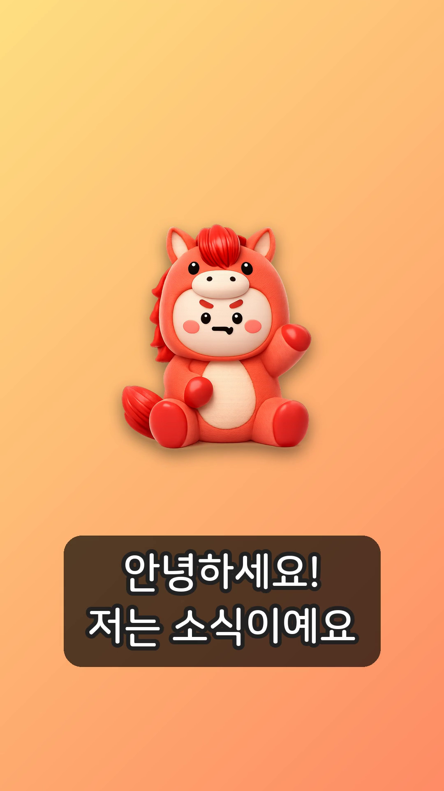

# 이미지를 영상으로 만들기 (image-to-video)

캐릭터 **이미지 + 내용(자막/내레이션)** 만 입력하면, 인스타그램 릴스용
**9:16 세로 MP4**(1080×1920)를 자동으로 만들어 주는 프로그램입니다.

흔한 "캐릭터 릴스" 구조를 그대로 구현했습니다:

- 세로 9:16 화면
- 캐릭터 등장 + 둥실거리는 애니메이션 (그림자 포함)
- 배경 켄번스(서서히 줌인) 효과
- 큰 자막 (외곽선 + 반투명 둥근 박스, 자동 줄바꿈)
- 장면 전환 (크로스페이드 / 하드컷)
- 배경음악 + (선택)한국어 TTS 내레이션

<p align="center">
  
</p>

---

## 1. 설치

```bash
# 시스템 의존성
apt-get install -y ffmpeg fonts-nanum

# 파이썬 패키지
pip install Pillow
pip install gTTS      # (선택) 한국어 TTS 내레이션을 쓸 때만
```

## 2. 빠른 시작

### 방법 A — 설정 파일로 (권장)

```bash
python make_reel.py --config examples/sosik_sample.json -o output/sosik.mp4
```

### 방법 B — 명령어 한 줄로 (간단)

```bash
python make_reel.py \
  --image assets/sosik.png \
  --text "안녕하세요!" \
  --text "좋은 소식을 가져왔어요" \
  --text "프로필 링크 확인!" \
  --duration 2.8 \
  --music assets/demo_bgm.m4a \
  -o output/quick.mp4
```

`--text` 를 여러 번 쓰면 장면이 그만큼 늘어납니다.

---

## 3. 설정 파일(JSON) 구조

`examples/sosik_sample.json` 을 복사해서 수정하면 됩니다.

```jsonc
{
  "title": "릴스 제목",
  "width": 1080, "height": 1920, "fps": 30,   // 9:16 기본값
  "transition": "fade",        // fade(크로스페이드) | cut(하드컷)
  "transition_dur": 0.4,

  "background": {              // 전역 배경
    "type": "gradient",       // gradient | solid | image
    "colors": ["#FFE082", "#FF8A65"],
    "direction": "diagonal"   // vertical | diagonal
  },

  "character": {              // 전역 캐릭터
    "image": "../assets/sosik.png",
    "scale": 0.6,             // 화면 폭 대비 캐릭터 크기 (0~1)
    "y": 0.42,                // 세로 위치 (0=위, 1=아래)
    "anim": "bob",            // bob(둥실) | float(좌우) | none
    "shadow": true
  },

  "caption": {                // 자막 스타일
    "position": 0.76,         // 자막 세로 위치
    "font_size": 84,
    "color": "#FFFFFF",
    "stroke_color": "#222222",
    "stroke_width": 10,
    "box": true,              // 자막 뒤 반투명 박스
    "box_color": "#000000AA",
    "max_chars_per_line": 11  // 자동 줄바꿈 기준 글자 수
  },

  "music": "../assets/demo_bgm.m4a",
  "music_volume": 0.5,
  "tts": false,               // true 면 자막을 한국어 음성으로 자동 변환
  "tts_lang": "ko",

  "scenes": [
    { "text": "첫 장면\n자막", "duration": 2.6, "emphasis": true },
    { "text": "두 번째 장면", "duration": 2.8,
      "background": { "type": "gradient", "colors": ["#80DEEA", "#26A69A"] },
      "character": "../assets/another.png"     // 장면별로 배경/캐릭터 교체 가능
    }
  ]
}
```

### 장면(scene) 옵션
| 키 | 설명 |
|----|------|
| `text` | 자막. `\n` 으로 줄바꿈. 긴 줄은 자동 줄바꿈. |
| `duration` | 장면 길이(초). TTS 사용 시 음성 길이에 맞춰 자동 연장. |
| `emphasis` | `true` 면 자막을 더 크게(강조 장면). |
| `background` | 이 장면만 다른 배경으로 덮어쓰기. |
| `character` | 이 장면만 다른 캐릭터 이미지로 교체. |

---

## 4. 음성(내레이션) 옵션

- **자막만 (기본)** — `tts: false`, 음악만. 인터넷 불필요.
- **한국어 TTS 자동** — `tts: true`. 각 장면 자막을 음성으로 변환해 타이밍에 맞춰
  배치합니다. (Google TTS 사용 — 인터넷 필요)
- **직접 녹음 사용** — 설정에 `"narration": "경로/voice.mp3"` 를 넣으면 그 음성을
  전체 트랙으로 사용합니다.

> TTS 는 네트워크가 막히면 자동으로 "음성 없이" 진행하므로 영상은 항상 생성됩니다.

---

## 5. 배경음악

직접 보유한/라이선스가 있는 음악 파일을 `music` 에 지정하세요.
테스트용 합성 BGM 이 필요하면:

```bash
python make_demo_bgm.py assets/demo_bgm.m4a 20    # 20초짜리 사인파 패드
```

---

## 6. 폴더 구조

```
image-to-video/
├── make_reel.py          # 메인 CLI
├── make_demo_bgm.py      # 데모 배경음악 생성기
├── reel/
│   ├── config.py         # 설정(JSON) 로딩
│   ├── fonts.py          # 한국어 폰트 탐색
│   ├── render.py         # Pillow 레이어 렌더링(배경/캐릭터/자막)
│   ├── video.py          # ffmpeg 합성/전환/오디오 믹스
│   ├── audio.py          # TTS 타임라인 배치
│   ├── tts.py            # 한국어 TTS(선택)
│   └── ffutil.py         # ffmpeg/ffprobe 유틸
├── examples/sosik_sample.json
├── assets/               # 캐릭터 이미지, 음악
└── output/               # 결과 MP4 (git 제외)
```

---

## 7. 자주 묻는 것

- **캐릭터를 바꾸려면?** `character.image` 에 PNG 경로만 바꾸면 됩니다.
  배경이 투명한 PNG 일수록 깔끔합니다.
- **세로 말고 정사각형(1:1)?** `width`/`height` 를 1080×1080 등으로 바꾸세요.
- **글자가 잘려요** → `caption.max_chars_per_line` 를 줄이거나 `font_size` 를 낮추세요.
- **폰트를 바꾸려면?** 설정에 `"font": "/경로/MyFont.ttf"` 추가.
